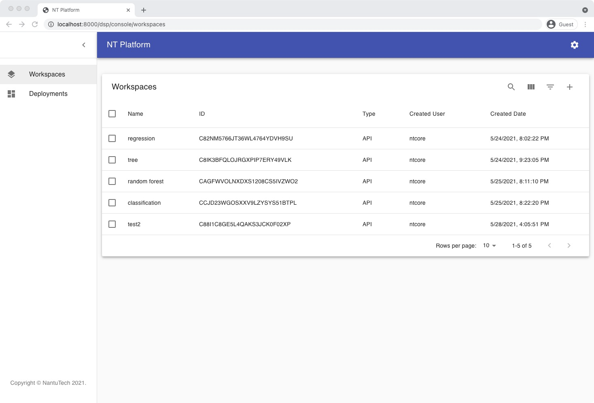

## <b>Quick Start</b> <!-- {docsify-ignore} -->
### Setup Environment

1. **Download and install Docker**

  NT-Core platform depends on docker to start local instances. Please follow this <em>[docker official instruction](https://docs.docker.com/get-started/#download-and-install-docker)</em> to download and install the Docker engine.

2. **Download NTcore github repo**

  Download the NTCore repository via git clone command
  ```
  git clone https://github.com/nantu-io/ntcore.git
  ```

3. **Start NTCore server**

  goto ntcore folder(make sure docker service is up and running)
  ```
  cd ntcore/
  docker-compose up
  ```

4. **Go to NT-Core Home page**
  Go to <em>http://localhost:8180/dsp/console/home</em> in your browser. If you can see following NT home page, that means the environment has been setup correctly and you can start play with the platform now.
  

---
### Build first model
The following example uses Sklearn to build a simple Decision Tree model and uses NTCore to record the model results.

Installation：
```
pip3 install ntcore
```

Modeling and version control:
```
# Config the ntcore client
from ntcore import client
client.set_endpoint('http://localhost:8000')
client.autolog('C8W60XEPH7DA3AAH3S41PJZ3OV')

# Prepare the training dataset
from sklearn import datasets
iris = datasets.load_iris()

# Init the model
from sklearn.ensemble import RandomForestClassifier
clf = RandomForestClassifier(max_depth=2, random_state=0)

# Start an experiment run
with client.start_run():
    clf.fit(iris.data, iris.target_names[iris.target])
```
