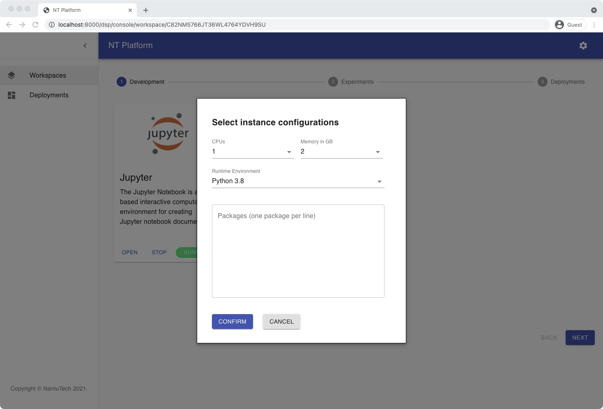
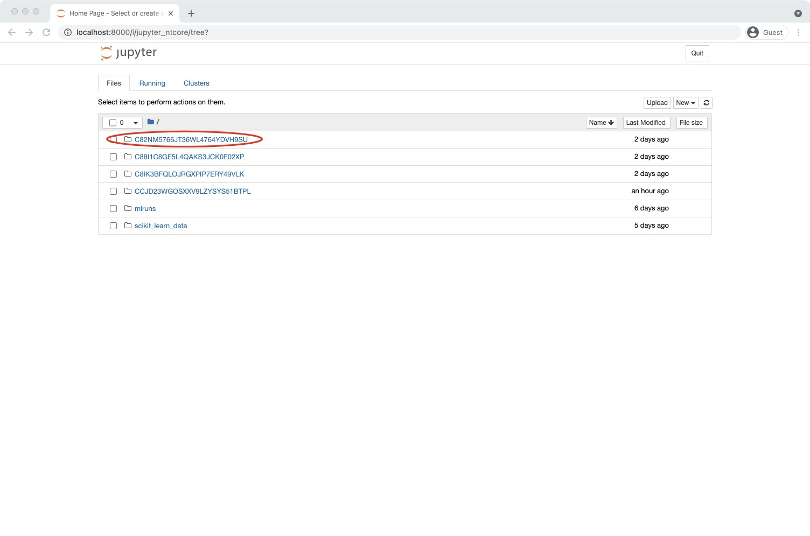
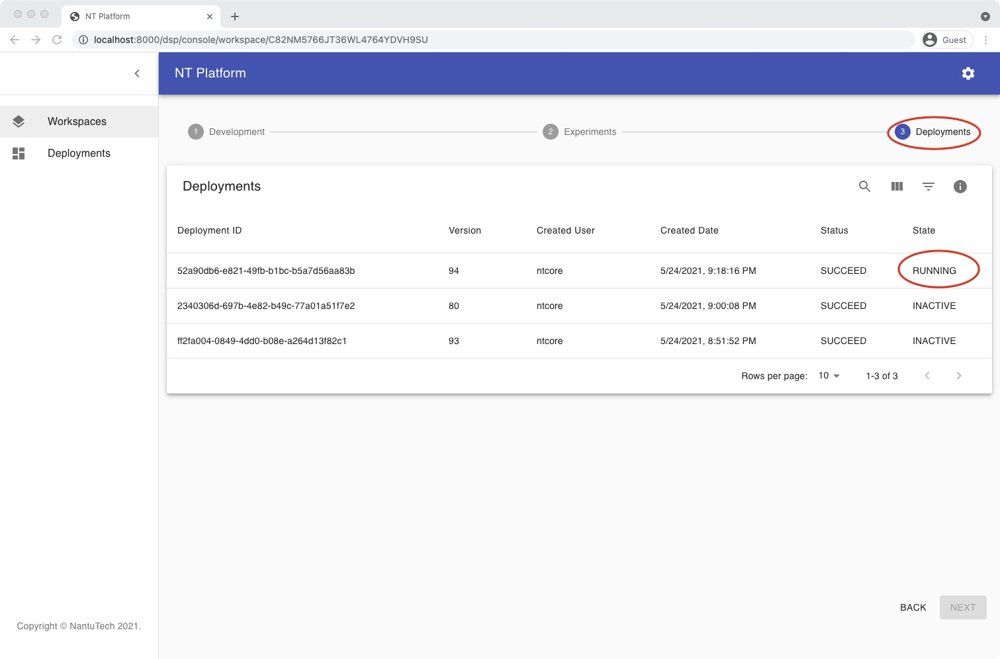

##  <b>Tutorial</b> <!-- {docsify-ignore} -->

### Create Workspace
Each Workspace corresponds to a complete end-to-end modeling process, including data upload, data processing, model experiment to model deployment.

When creating a Workspace, the user can select the corresponding development type.


After successfully creating Workspace, you can see the complete model development process.


---
### Start Instance
Starting Instance will provide users with corresponding model development tools. Users can customize all required computing power and install software packages required for model development.



After opening Jupyter, a corresponding folder will be automatically generated associated with the Workspace.



---
### Model Experiment
NTCore provides model version control. User can adjust parameters, record and compare the results of different models through the platform.

The user needs to complete the following installation:

```
git clone https://github.com/nantutech/mlflow.git mlflow-nantu
pip3 install ntcore
```

For example, when experimenting with SKlearn for model development, the model results can be recorded by simply adding the following equation to the code.

```
ntcore.sklearn.autolog()
```

The model results will be presented on the UI. Below are sample results from the different model experiments.


---
### Model Deploy
When users are satisfied with the model results, they can publish the results through UI with one click. NTcore will automatically generate the model API.


After successful deployment, user can check the status in UI.



Users can use the model API with curl or Python.

<b>Curl Example:</b>
```
curl -H "Content-Type: application/json" -X POST --data '{"data": [[1,1 ...]]}' http://localhost:8000/s/C82NM5766JT36WL4764YDVH9SU/predict
```

<b>Python Example:</b>
```
import requests
requests.post('http://localhost:8000/s/C82NM5766JT36WL4764YDVH9SU/predict', data={"data": [[1,1 ...]]})
```

Tracking of all successfully deployable models.

