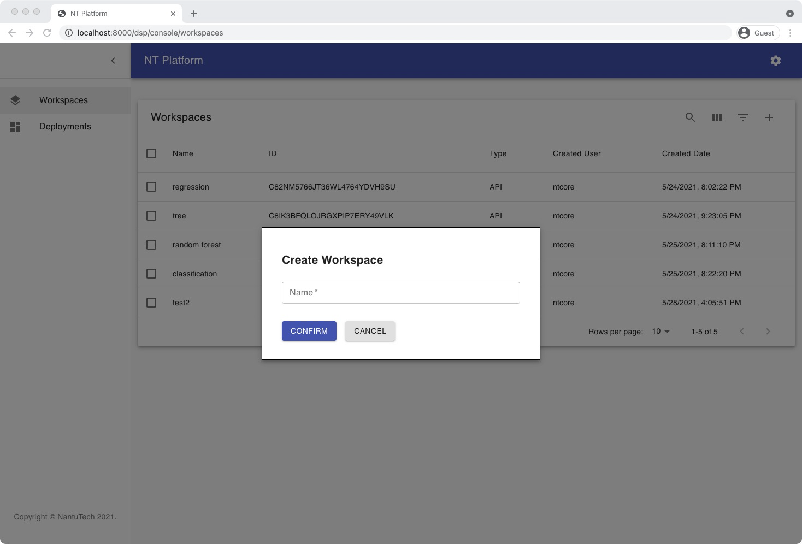
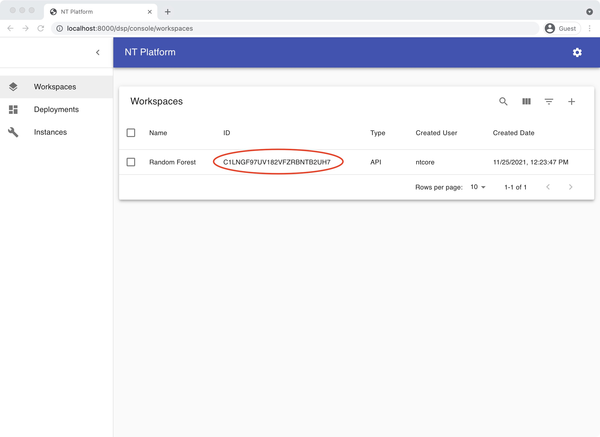
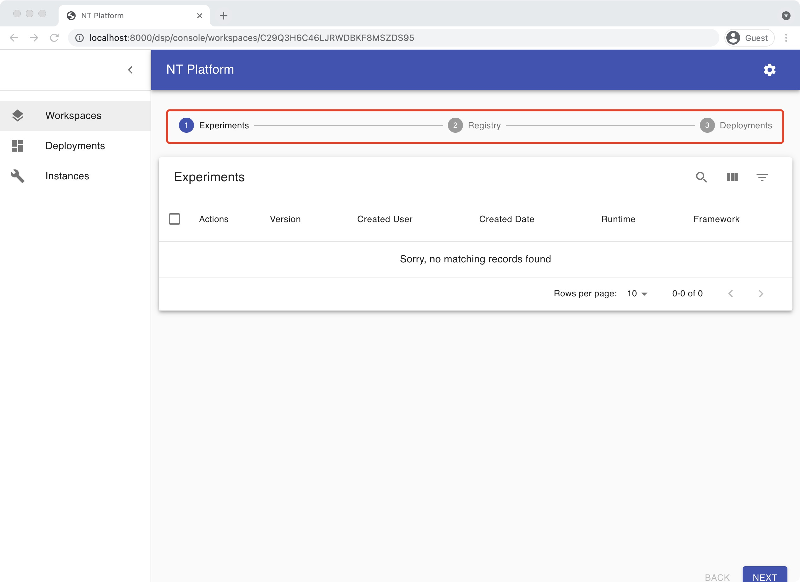
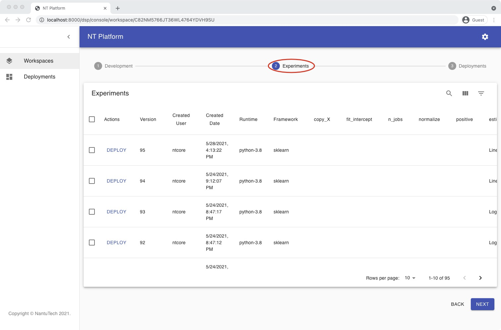
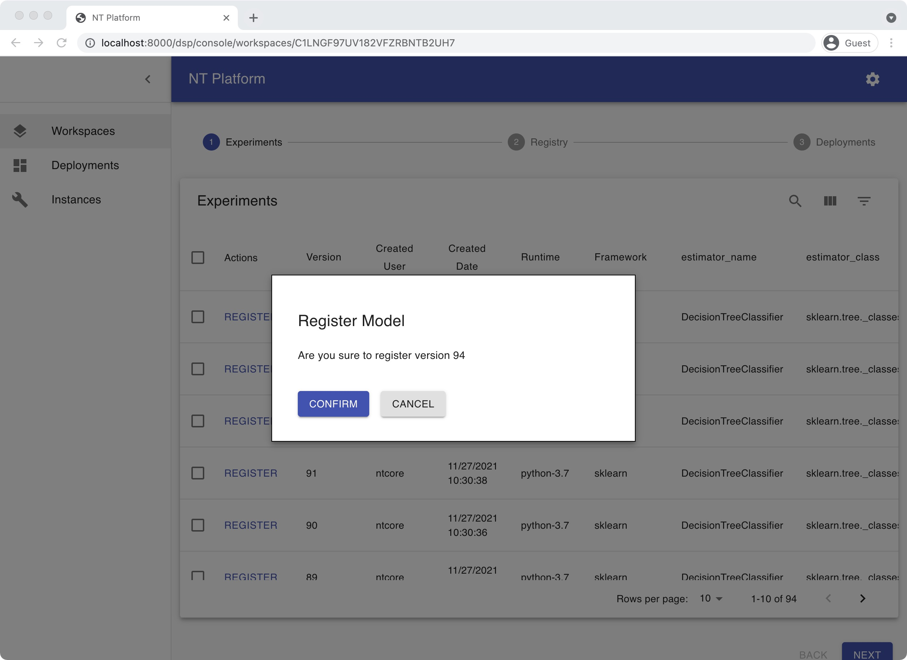
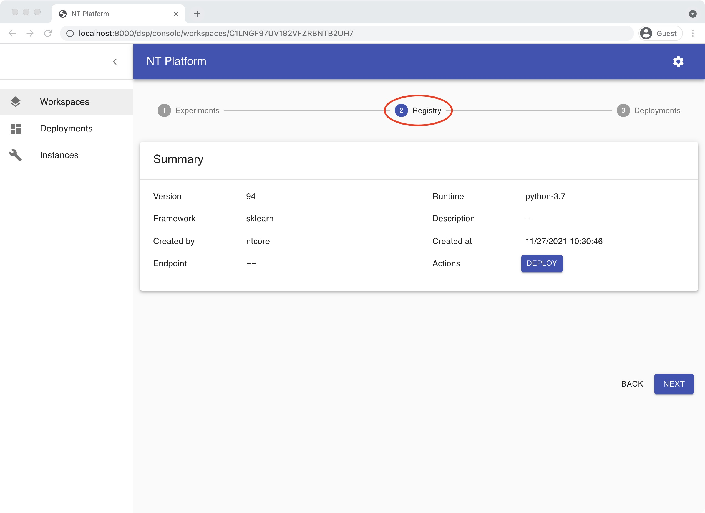
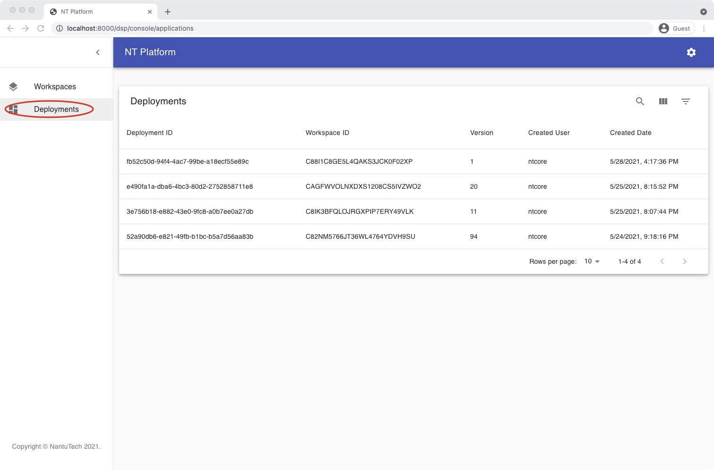

##  <b>详细教程</b> <!-- {docsify-ignore} -->

### 创建Workspace
每一个Workspace对应着一个完整的端到端建模过程，包括数据上传，数据处理，模型实验到模型部署。

创建Workspace的时候，用户可以选择对应的开发类型。



成功创建Workspace后，将产生对应的ID。



进入Workspace后，可以看到模型实验，模型注册以及模型部署开发流程。



---
### 模型Experiment
NTCore提供模型版本控制功能，用户调整参数，并通过平台记录与对比不同模型结果。

用户需要完成以下安装：

```
git clone https://github.com/nantu-io/ntcore.git
pip3 install ntcore
```

比如在运用SKlearn进行模型开发实验时，只需在代码中加入以下方程便可记录模型结果。

```
from ntcore import client
#指向URL
client.set_endpoint('http://localhost:8000')
#指向指向workspace ID
client.autolog('C8W60XEPH7DA3AAH3S41PJZ3OV')
```

模型结果将会在界面上得到展示。以下是对所有模型实验结果进行记录。



---
### 模型Registry
在得到比较满意的模型结果后，用户可以对将要部署的模型进行注册并进行测试，以确保模型部署的准确性。



已注册模型展示。



---
### 模型Deploy
测试无误后，用户可以通过UI一键发布成果。NTCore将自动生成模型API。


用户可以用curl或Python对模型API进行使用。

<b>Curl例子:</b>
```
curl -H "Content-Type: application/json" -X POST --data '{"data": [[1,1 ...]]}' http://localhost:8000/s/C82NM5766JT36WL4764YDVH9SU/predict
```

<b>Python例子:</b>
```
import requests
requests.post('http://localhost:8000/s/C82NM5766JT36WL4764YDVH9SU/predict', data={"data": [[1,1 ...]]})
```

对于所有成功deploy的模型进行汇总和追踪。


